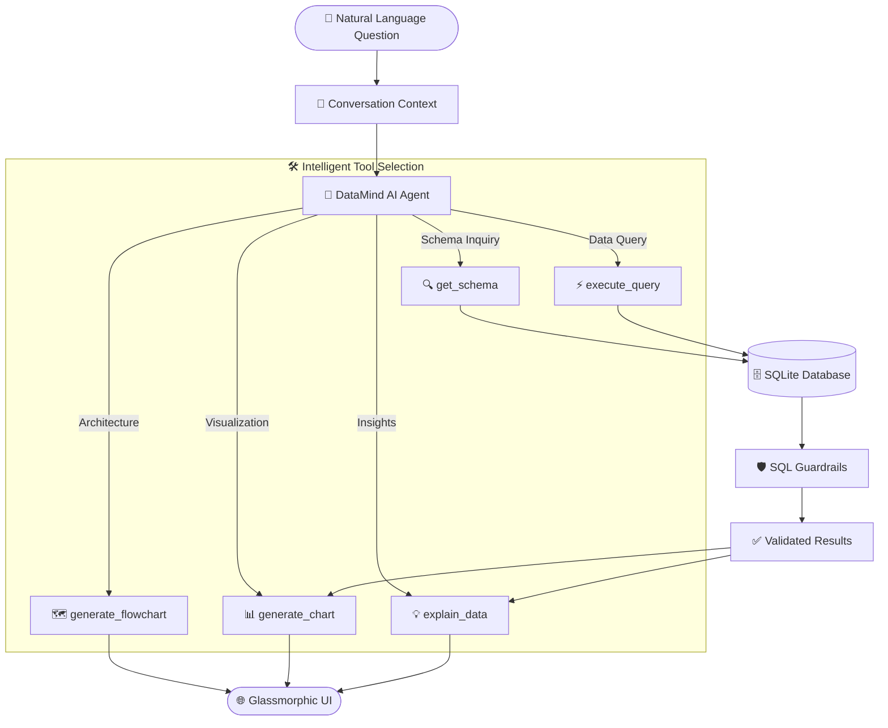

<div align="center">

# 🧠 DataMind AI

### *Transform Natural Language into Database Insights*

[](https://www.python.org/)
[](https://fastapi.tiangolo.com/)
[](https://openai.com/)
[](https://ai.google.dev/)
[](LICENSE)

**Ask questions in plain English → Get SQL, Interactive Charts & AI Insights — Instantly**

[🚀 Quick Start](#-quick-start) • [✨ Features](#-key-features) • [🎯 Demo](#-try-it-now) • [📚 Documentation](#-documentation)


</div>

---

## 🌟 What is DataMind AI?

**DataMind AI** is an intelligent database assistant that bridges the gap between natural language and data analytics. Built with cutting-edge agentic AI, it enables **anyone** to query databases, generate visualizations, and extract insights—no SQL knowledge required.

### 🎯 Perfect For

- 📊 **Business Analysts** - Query data without learning SQL
- 💼 **Product Managers** - Get instant insights for decision-making
- 👨‍💻 **Developers** - Rapid database exploration and prototyping
- 🎓 **Students & Educators** - Learn databases through natural interaction
- 🏢 **Enterprise Teams** - Democratize data access across organizations

---

## ✨ Key Features

### 🤖 **Dual Agent Architecture**

<table>
<tr>
<td width="50%">

#### **Classic Agent** 
*Fast & Straightforward*
- ⚡ Rapid query execution
- 🎯 Single-step operations
- 📈 Automatic visualizations
- 💬 Conversational memory

</td>
<td width="50%">

#### **Intelligent Agent** ⭐ NEW
*Production-Quality Analytics*
- 🧠 Deep question understanding
- 🔗 Multi-step analytical reasoning
- ✅ Result validation & correction
- 🎨 Multiple coordinated visualizations
- 🛡️ **NEVER generates partial answers**

</td>
</tr>
</table>

### 🛠️ **5 Powerful Tools**

| Tool | Description | Example |
|:-----|:------------|:--------|
| 🔍 **Schema Discovery** | Inspect database structure, relationships, and sample data | *"What tables are in the database?"* |
| ⚡ **Query Executor** | Execute validated SQL with built-in guardrails | *"Top 5 products by revenue"* |
| 📊 **Data Visualizer** | Auto-generate Plotly charts (Bar, Line, Pie, Scatter) | *"Show monthly sales trend"* |
| 🗺️ **System Diagrammer** | Generate ER diagrams and flowcharts | *"Show me the database schema"* |
| 💡 **Insight Explainer** | Extract key statistics and business insights | *"Explain the revenue distribution"* |

### 🔐 **Enterprise-Grade Security**

- ✅ **SQL Injection Protection** - Token-based validation using `sqlparse`
- ✅ **Read-Only Enforcement** - Only `SELECT` queries allowed
- ✅ **Multi-Statement Blocking** - Prevents batch SQL attacks
- ✅ **Input Sanitization** - Comprehensive validation pipeline

### 🎨 **Beautiful Glassmorphic UI**

- 🌓 **Dark/Light Mode** - Elegant theme switching
- 📱 **Fully Responsive** - Works on desktop, tablet, and mobile
- ⚡ **Real-Time Streaming** - See results as they arrive (SSE)
- 🎭 **Smooth Animations** - Professional glassmorphic design
- 📋 **SQL Transparency** - View generated queries

### 🌍 **Multi-Provider LLM Support**

```python
# Choose your AI provider
LLM_PROVIDER=openai    # GPT-4, GPT-3.5-turbo
LLM_PROVIDER=gemini    # Gemini 1.5 Pro/Flash
LLM_PROVIDER=groq      # Llama 3.1 (Ultra-fast)
LLM_PROVIDER=mock      # Offline testing
```

---

## 🚀 Quick Start

### 📋 Prerequisites

- **Python 3.10+**
- **API Key** from [OpenAI](https://platform.openai.com/), [Google AI](https://ai.google.dev/), or [Groq](https://console.groq.com/)

### ⚡ Installation (5 Minutes)

```bash
# 1️⃣ Clone the repository
git clone https://github.com/HEMANTH2208/DataVue-AI.git
cd DataVue-AI

# 2️⃣ Create virtual environment
python -m venv venv
source venv/bin/activate  # Windows: venv\Scripts\activate

# 3️⃣ Install dependencies
pip install -r requirements.txt

# 4️⃣ Configure environment
cp .env.example .env
# Edit .env and add your API key:
# LLM_PROVIDER=openai
# OPENAI_API_KEY=sk-...
```

### 🎯 Run the Application

#### Option 1: Python (Development)

```bash
# Seed the demo database
python -m src.database.seed_databases

# Start the server
uvicorn src.main:app --reload --port 8000
```

#### Option 2: Docker (Production)

```bash
# One-command deployment
docker-compose up --build
```

### 🌐 Access the Application

Open your browser and navigate to:

```
http://localhost:8000
```

**Two Agent Endpoints:**
- **Classic:** `/api/query/stream`
- **Intelligent:** `/api/query/intelligent/stream` ⭐

---

## 🎯 Try It Now

### 💬 Example Queries

<table>
<tr>
<td width="50%">

#### 📊 **Analytics Queries**
```
"What are the top 5 products by revenue?"
"Show monthly sales trend for 2025"
"Which category has the highest revenue?"
"What's the average order value per category?"
"Show order distribution by payment method"
```

</td>
<td width="50%">

#### 🔍 **Multi-Part Analytical Questions**
```
"Which category generates the highest revenue, 
 and what are the top 3 products in that category?"

"Which customer spent the most, 
 and what products did they purchase?"

"Which month had highest sales, 
 and what were the top categories?"
```

</td>
</tr>
<tr>
<td width="50%">

#### 🗺️ **System & Architecture**
```
"Show me the ER diagram of the database"
"Generate the DataMind AI workflow diagram"
"Explain the database schema"
"What tables are available?"
```

</td>
<td width="50%">

#### 💬 **Follow-Up Conversations**
```
User: "Top 5 products by revenue"
AI: [Shows results]
User: "Now show their monthly trends"
AI: [Uses context from previous query]
```

</td>
</tr>
</table>

---

## 🏗️ Architecture

### 🔄 Agentic Workflow



### 📦 Project Structure

```
DataMind-AI/
├── 🎨 public/                    # Frontend (Glassmorphic UI)
│   ├── index.html               # Main dashboard
│   ├── style.css                # Design system
│   ├── app.js                   # SSE client + Plotly/Mermaid
│   └── vendor/                  # Offline-safe JS bundles
│
├── ⚙️ src/
│   ├── main.py                  # FastAPI server (REST + SSE)
│   ├── config.py                # Environment configuration
│   │
│   ├── 🤖 agent/                # Intelligence Layer
│   │   ├── intelligent_agent.py      # Production-quality agent ⭐
│   │   ├── agent_controller.py       # Classic agent
│   │   ├── question_analyzer.py      # Deep question understanding
│   │   ├── query_planner.py          # Multi-step reasoning
│   │   ├── result_validator.py       # Result validation
│   │   ├── quality_gate.py           # Final quality checks
│   │   └── conversation.py           # Multi-turn memory
│   │
│   ├── 🛠️ tools/                # Tool Registry
│   │   ├── base.py                   # Abstract tool interface
│   │   ├── schema_discovery.py       # 🔍 Schema inspection
│   │   ├── query_executor.py         # ⚡ SQL execution
│   │   ├── visualizer.py             # 📊 Chart generation
│   │   ├── diagrammer.py             # 🗺️ ER/flowchart diagrams
│   │   └── insight_explainer.py      # 💡 Business insights
│   │
│   ├── 🗄️ database/             # Data Layer
│   │   ├── db_manager.py             # SQLite connection
│   │   ├── guardrails.py             # SQL validation & security
│   │   └── seed_databases.py         # Demo data seeder
│   │
│   └── 🌐 services/             # External Services
│       └── llm_service.py            # Multi-provider LLM client
│
├── 🧪 tests/                    # Test Suite
│   ├── test_guardrails.py            # Security tests
│   ├── test_visualizer.py            # Chart logic tests
│   └── test_intelligent_agent.py     # Agent integration tests
│
├── 📚 Documentation/
│   ├── QUICK_START.md                # Getting started guide
│   ├── INTELLIGENT_AGENT_UPGRADE.md  # Intelligent agent docs
│   ├── PRODUCTION_ENHANCEMENTS_COMPLETE.md
│   └── CRITICAL_MULTI_PART_RULE_IMPLEMENTED.md
│
├── 🐳 Deployment/
│   ├── Dockerfile                    # Container image
│   ├── docker-compose.yml            # One-command deploy
│   └── requirements.txt              # Python dependencies
│
└── 📊 data/                     # SQLite databases (auto-created)
```

---

## 🎓 Intelligent Agent Deep Dive

### 🧠 The UNDERSTAND → PLAN → EXECUTE → VALIDATE Pipeline

The **Intelligent Agent** is a production-quality system that ensures **100% reliable answers** to analytical questions.

#### 1️⃣ **UNDERSTAND Phase**
```python
# Deep semantic analysis of the question
analysis = {
    "question_type": "multi_step",
    "entities": ["category", "product"],
    "metrics": ["revenue"],
    "requirements": [
        "Find highest revenue category",
        "Find top 3 products in that category"
    ],
    "dependencies": "Stage 2 depends on Stage 1 result"
}
```

#### 2️⃣ **PLAN Phase**
```python
# Sequential execution plan with validation rules
plan = {
    "Stage 1": "Query ALL categories by revenue",
    "Stage 2": "Extract highest category_id from Stage 1",
    "Stage 3": "Query products WHERE category_id = <validated_value>",
    "Stage 4": "Visualize category comparison",
    "Stage 5": "Visualize top 3 products",
    "Stage 6": "Generate complete explanation"
}
```

#### 3️⃣ **EXECUTE Phase**
```python
# Execute each stage with dependencies
for stage in plan:
    result = execute_stage(stage)
    validate_result(result, stage.validation_rules)
    if not validated:
        correct_and_retry()
    accumulated_results[stage.id] = result
```

#### 4️⃣ **VALIDATE Phase**
```python
# CRITICAL: Verify ALL requirements met
def verify_all_requirements_met():
    if not all_stages_completed():
        return False
    if any_stage_returned_zero_rows():
        return False
    if any_extraction_failed():
        return False
    return True  # ALL CHECKS PASSED
```

### 🛡️ **Critical Multi-Part Question Rule**

**NEVER generate partial answers!**

✅ **Correct Behavior:**
```
Question: "Which category has highest revenue, and top 3 products?"

Stage 1: Query ALL categories → Returns all with revenue
Stage 2: Extract highest → category_id=1, name="Electronics"
Stage 3: Query products WHERE category_id=1 → Returns 3 products
Verify: All stages succeeded? YES

Answer: "Electronics generates the highest revenue at ₹225,122.08.

Top 3 products in Electronics:
1. Smart Watch Pro: ₹74,997.00
2. Noise Cancelling Earbuds: ₹38,547.43
3. Mechanical Keyboard: ₹36,007.23"
```

❌ **Prevented Behavior:**
```
# NEVER do this:
Answer: "Electronics has the highest revenue at ₹225,122.08."
[Missing: product information - PARTIAL ANSWER]

# Or this:
SQL: SELECT * FROM products WHERE category_id = 1  -- HARDCODED!
[Should use actual value from Stage 1]
```

See [CRITICAL_MULTI_PART_RULE_IMPLEMENTED.md](CRITICAL_MULTI_PART_RULE_IMPLEMENTED.md) for details.

---

## 📊 Chart Selection Intelligence

DataMind AI automatically selects the optimal visualization:

| Data Pattern | Intent Keywords | Chart Type | Use Case |
|:-------------|:----------------|:-----------|:---------|
| **Categorical + Numeric** (≤15 rows) | top, best, compare, ranking | **Bar Chart** | Product rankings, category comparison |
| **Categorical + Numeric** (>15 rows) | — | **Horizontal Bar** | Long category lists |
| **Date/Time + Numeric** | trend, over time, monthly, growth | **Line Chart** | Sales trends, time-series analysis |
| **Categorical + Numeric** (≤8 rows) | distribution, proportion, share | **Pie Chart** | Market share, payment methods |
| **Two Numeric Columns** | correlation, relationship, vs | **Scatter Plot** | Price vs. sales correlation |

---

## 🔐 Security & Guardrails

### SQL Injection Protection

```python
# ✅ Allowed: Safe SELECT queries
"SELECT name, price FROM products WHERE category_id = 1"

# ❌ Blocked: Multi-statement injection
"SELECT * FROM users; DROP TABLE users;--"

# ❌ Blocked: Write operations
"DELETE FROM products WHERE id = 1"
"UPDATE prices SET price = 0"

# ❌ Blocked: Schema manipulation
"CREATE TABLE malicious_table"
"ALTER TABLE users ADD COLUMN admin BOOLEAN"
```

### Validation Pipeline

1. **Token-based parsing** using `sqlparse`
2. **Statement type verification** (SELECT only)
3. **Multi-statement detection** (reject semicolons)
4. **Keyword blacklist** (DROP, DELETE, UPDATE, etc.)
5. **Result validation** against expected schema

---

## 🌍 Environment Variables

Create a `.env` file:

```bash
# LLM Provider Configuration
LLM_PROVIDER=openai              # openai | gemini | groq | mock

# OpenAI Configuration
OPENAI_API_KEY=sk-...
OPENAI_MODEL=gpt-4o              # gpt-4o | gpt-4-turbo | gpt-3.5-turbo

# Google Gemini Configuration
GEMINI_API_KEY=...
GEMINI_MODEL=gemini-1.5-flash    # gemini-1.5-pro | gemini-1.5-flash

# Groq Configuration (Llama 3.1)
GROQ_API_KEY=...
GROQ_MODEL=llama-3.1-70b-versatile

# Database Configuration
DEFAULT_DB_PATH=data/ecommerce.db

# Server Configuration
HOST=0.0.0.0
PORT=8000
```

---

## 🧪 Testing

```bash
# Run all tests
pytest tests/ -v

# Test SQL guardrails
pytest tests/test_guardrails.py -v

# Test chart selection logic
pytest tests/test_visualizer.py -v

# Test intelligent agent
python test_intelligent_agent.py

# Test multi-part question rule
python test_multi_part_rule.py
```

---

## 📚 Documentation

- 📖 [Quick Start Guide](QUICK_START.md) - Get up and running in 5 minutes
- 🤖 [Intelligent Agent Documentation](INTELLIGENT_AGENT_UPGRADE.md) - Deep dive into the agent architecture
- 🛡️ [Multi-Part Question Rule](CRITICAL_MULTI_PART_RULE_IMPLEMENTED.md) - How partial answers are prevented
- ⚡ [Production Enhancements](PRODUCTION_ENHANCEMENTS_COMPLETE.md) - Quality improvements and validation
- 📋 [Implementation Summary](IMPLEMENTATION_SUMMARY.md) - Complete feature overview

---

## 🎥 Demo Video Script (3-5 Minutes)

### 1️⃣ **Introduction** (30s)
- Show the glassmorphic UI
- Explain the agentic tool-calling pattern
- Highlight dual agent architecture

### 2️⃣ **Use Case: Sales Analytics** (60s)
- Ask: *"What are the top 5 best-selling products by total revenue?"*
- Show: SQL panel → Bar chart → Executive summary
- Demonstrate: Real-time streaming

### 3️⃣ **Use Case: ER Diagram** (45s)
- Ask: *"Show me the ER diagram of the database"*
- Show: Mermaid rendering with relationships

### 4️⃣ **Use Case: Multi-Part Question** (60s)
- Ask: *"Which category has highest revenue, and what are the top 3 products?"*
- Show: Multi-stage execution → Two charts → Complete answer
- Highlight: No partial answers, validated results

### 5️⃣ **Multi-Turn Follow-up** (45s)
- Ask: *"Now show the monthly trend for these products"*
- Show: Conversation context retention

### 6️⃣ **Architecture Walkthrough** (30s)
- Expand tool trace drawer
- Walk through the execution sequence
- Show validation checkpoints

---

## 🤝 Contributing

We welcome contributions! Here's how you can help:

1. 🐛 **Report Bugs** - Open an issue with reproduction steps
2. 💡 **Suggest Features** - Share your ideas for improvements
3. 🔧 **Submit Pull Requests** - Follow our coding standards
4. 📖 **Improve Documentation** - Help others understand the project

### Development Setup

```bash
# Fork and clone the repository
git clone https://github.com/YOUR_USERNAME/DataVue-AI.git

# Create a feature branch
git checkout -b feature/amazing-feature

# Make your changes and test
pytest tests/ -v

# Commit and push
git commit -m "Add amazing feature"
git push origin feature/amazing-feature

# Open a Pull Request
```

---

## 🗺️ Roadmap

### 🎯 Current Version (v1.0)
- ✅ Dual agent architecture
- ✅ 5 intelligent tools
- ✅ Multi-provider LLM support
- ✅ SQL injection protection
- ✅ Glassmorphic UI
- ✅ Real-time streaming

### 🚀 Upcoming Features (v2.0)
- 🔄 **Multi-Database Support** - PostgreSQL, MySQL, MongoDB
- 📊 **Custom Dashboards** - Save and share visualizations
- 🔗 **API Integrations** - Connect external data sources
- 🤖 **Advanced Analytics** - Predictive modeling, anomaly detection
- 👥 **Collaboration** - Team workspaces and sharing
- 🌐 **Cloud Deployment** - One-click cloud hosting

---

## 📄 License

This project is licensed under the **MIT License** - see the [LICENSE](LICENSE) file for details.

---

## 💖 Acknowledgments

- **FastAPI** - Modern web framework
- **Plotly** - Interactive visualizations
- **Mermaid.js** - Beautiful diagrams
- **OpenAI / Google / Groq** - LLM providers
- **SQLite** - Lightweight database engine

---

## 📞 Support & Contact

- 🐛 **Issues:** [GitHub Issues](https://github.com/HEMANTH2208/DataVue-AI/issues)
- 💬 **Discussions:** [GitHub Discussions](https://github.com/HEMANTH2208/DataVue-AI/discussions)
- 📧 **Email:** [your-email@example.com]

---

<div align="center">

### ⭐ Star this repository if you find it useful!

**Made with ❤️ by the DataMind AI Team**

[⬆ Back to Top](#-datamind-ai)

</div>
